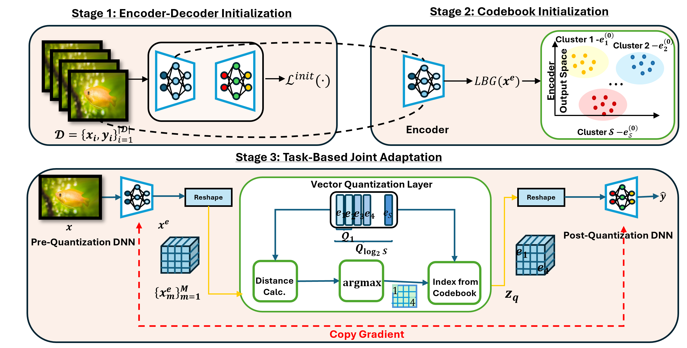

# Adapative Rate Task-Oriented Vector Quantization (ARTOVeQ)

ARTOVeQ is designed to address the challenges of learned compression mechanisms that struggle to adapt their resolution over time-varying links. Most existing DNN-aided compression algorithms operate in a single-rate manner. In the context of remote inference, this introduces two notable challenges when communicating over time-varying links:
1. Once trained, the model's compression rate can not be altered
2. Inference can only begin after all the compressed features arrive at the inferring device

Our work tackles these challenges $`(1-2)`$ by designing a learned compression mechanism that is independent of the network architecture and focuses on the quantization process itself.

# Executing the code

In this repository, you will find four different Python files, each corresponding to a dedicated simulation from our paper. The codes are intended to be self-contained, meaning you can simply download the files and run them without needing external dependencies. However, it is important to note that while each file may seem similar at first glance, there are some fundamental differences.

## Available Files:
**`adaptivecb.py`**

This file serves as the main simulation for this project, with all other simulations based on it.

Inside, you will find the entire Deep Learning pipeline, including data preparation and preprocessing, the adaptive quantizer, and the training function. This is followed by a script that trains the model and performs inference. The file includes three flag variables: `use_VQVAE`, `use_split`, and `mixed_resolution`. Each flag variable corresponds to a specific simulation setting as described in the research article.

These flag variables determine the forward pass through the ARTOVeQ model:
  - If all the flag variables are set to `false`, the model uses the standard `forward` function.
  - If `use_VQVAE` is set to `true`, the model uses the `forward_with_vqvae` function.
  - If `use_split` is true, then the model uses the `forward_with_split` function. Note the bit configuration for each ADC must be given

**`successive_refinement.py`**

Termed Progressive ARTOVeQ, the script itself is very similar to `adaptivecb.py`, but does not contain any flag variables for different simulations and the construction of the codebook does not adhere to the nested structure as in ARTOVeQ.

For progressive ARTOVeQ, the codebook vectors each are extended by a single bit following a Minkowski sum. If **$`\mathcal{Q}_l `$**  represents the codebook at bit-rate $`l`$, and  **$`\tilde{e}^{(l)}_1, \tilde{e}^{(l)}_2`$** represent two new directions then the extended codebook  **$`\mathcal{Q}_{l+1}`$** is

  **$` \mathcal{\boldsymbol{Q}}_{l+1} = \mathcal{\boldsymbol{Q}}_{l} + \left\{\tilde{\boldsymbol{e}}^{(l)}_1, \tilde{\boldsymbol{e}}^{(l)}_2\right\} `$**

**`quantization_with_kmeans`**

Our code implementation operates in two steps. First, we train the unquantized MobileNetV2 model. Once it achieves satisfactory performance, we integrate the LBG algorithm into the pipeline and train only the decoder to align with task-oriented remote inference.

**`ResidualVQVAE.py`**

Based on the work of [Variable Rate Image Compression with Recurrent Neural Networks by Toderici et al.](https://https://arxiv.org/abs/1511.06085)

This code implements a progressive coding scheme using recurrent neural networks (RNNs). At each step, the RNN reconstructs the input with an additional residual term, which is then fed forward to achieve variable rates. A dedicated binarization technique is included for quantization.

  ### How to run the code

  To run the code simply run each `.py` file. Adjust the parameters in the command line. You will find default values under the Globals&Hyperparameter and additional parameters before the training and inference

  ### Modules within the Code  

Each file may have slightly different names for the modules, but the following functionalities are consistent across all files:  

- **`class AdaptiveVectorQuantizer()`**  
  Implements the adaptive vector quantization scheme. The codebooks are learned adaptively, progressing from low resolution to high resolution, following progressive learning principles.  

- **`class AdapCB_Model()`**  
  Implements the ARTOVeQ model, which includes the encoder, decoder, and classifier used for task-oriented inference.  

- **`function train()`**  
  Trains the ARTOVeQ model.  

- **`function scatter()`**  
  Visualizes the learned codebooks and the encoder output.  

- **`function init_weights()`**  
  Provides a warm start for the codebook vectors.  
  There are two options for initialization:  
  1. Randomly initializing the codebook vectors from a Multivariate Gaussian distribution.  
  2. Using the learned codebooks from the LBG algorithm.
